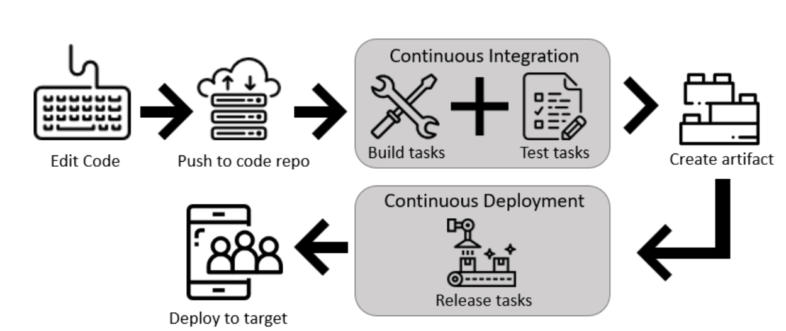
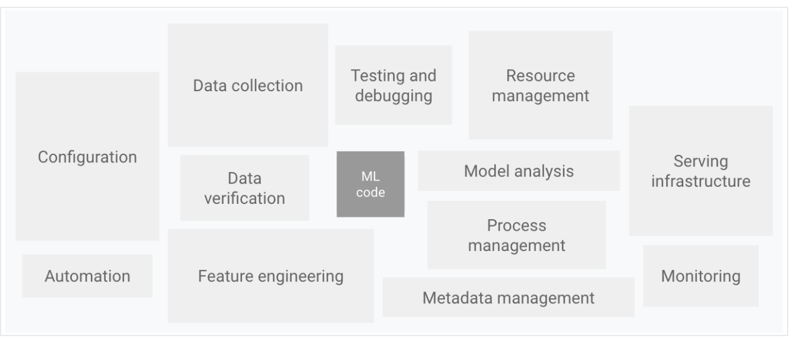
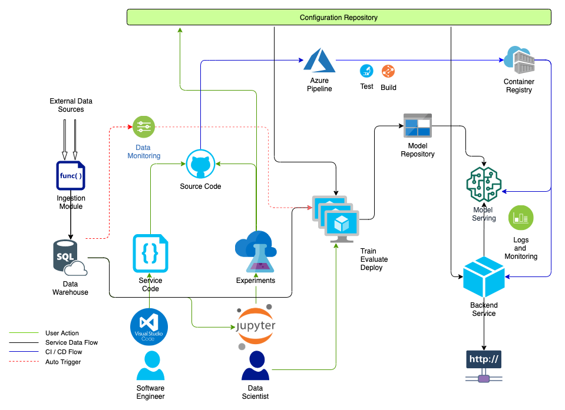

## Continuous Integration and Continuous Delivery for Machine Learning Applications

### 1. Background
In the pre-agile era, software teams worked on projects/features for months with a predetermined day in mind for integration and deployment. This process led to some major problems
* Integrating months of work by multiple teams lead to a large number of merge conflicts
* Features developed by different teams over the period of time were sometimes incompatible with each other and this fact remained unknown until the very end
* Since all the changes were integrated together, it became difficult to roll back if one particular feature did not work

### 2.CI/CD to the rescue.

_**Continuous Integration**_ is a software development practice where members of a team integrate their work frequently, usually, each person integrates at least daily - leading to multiple integrations per day. Each integration is verified by an automated build (including test) to detect integration errors as quickly as possible. This approach leads to significantly reduced integration problems and allows a team to develop cohesive software more rapidly

_**Continuous Delivery**_ is the ability to get changes of all types — including new features, configuration changes, bug fixes, and experiments — into production, or into the hands of users, safely and quickly in a sustainable way". -- Jez Humble and Dave Farley

The key test is that a _business sponsor could request that the current development version of the software can be deployed into production at a moment's notice_ - and nobody would bat an eyelid, let alone panic.

## How are ML applications different from traditional software applications?

#### Traditional Software Application Workflow

The process for developing, deploying, and continuously improving ML applications is much 
more complex compared to traditional software, such as a web service or a mobile application. 
Since ML Applications are subject to change in three axes: the code itself, the model, 
and the data. Their behavior is often complex and hard to predict, and they are harder to test, 
harder to explain, and harder to improve.
Besides the code, changes to ML models and the data used to train them are another type of 
change that needs to be managed and baked into the software delivery process

#### Components in ML Applications (Elements for ML systems. Adapted from Hidden Technical Debt in Machine Learning Systems)

#### Challenges in ML Applications in production:

- Team Skills

- Development

- Testing

- Deployment

- Production

### Our Machine Learning CI/CD Pipeline

### Setting up this Project on Azure

* [Spinning up a Azure SQL database](https://docs.microsoft.com/en-us/azure/azure-sql/database/single-database-create-quickstart?tabs=azure-portal)
* [CI/CD on Azure DevOps from GitHub repo](https://docs.microsoft.com/en-us/azure/devops/pipelines/repos/github?view=azure-devops&tabs=yaml)
* [Blob storage container on Azure](https://docs.microsoft.com/en-us/azure/storage/blobs/storage-quickstart-blobs-portal)
* [Using Azure container registry](https://docs.microsoft.com/en-us/azure/container-registry/container-registry-get-started-docker-cli)
* [Deploying docker image as Azure webapp and register webhook for auto deployment](https://docs.microsoft.com/en-us/learn/modules/deploy-run-container-app-service/1-introduction)
    * Make sure to run your webapp on port 443 when using Azure webapp as it's the post which is exposed

#### References
[1] [Continuous Delivery for Machine Learning](https://docs.microsoft.com/en-us/learn/modules/deploy-run-container-app-service/1-introduction) - Martin Fowler  
[2] [MLOps: Continuous delivery and automation pipelines in machine learning](https://cloud.google.com/solutions/machine-learning/mlops-continuous-delivery-and-automation-pipelines-in-machine-learning)  
[3] [Hidden Technical Debt in Machine Learning Systems](https://papers.nips.cc/paper/5656-hidden-technical-debt-in-machine-learning-systems.pdf) - Google Inc.
